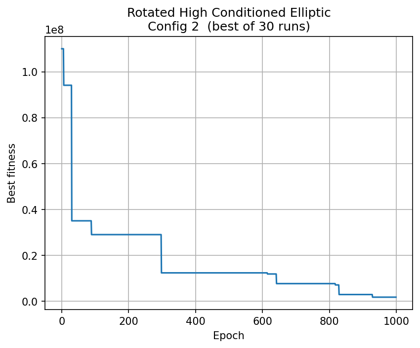
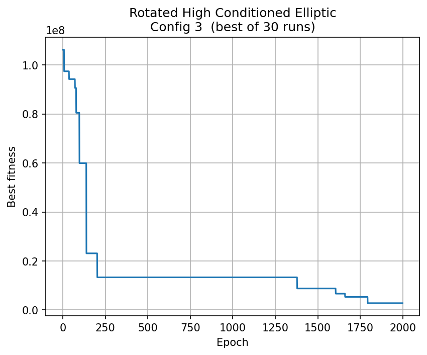
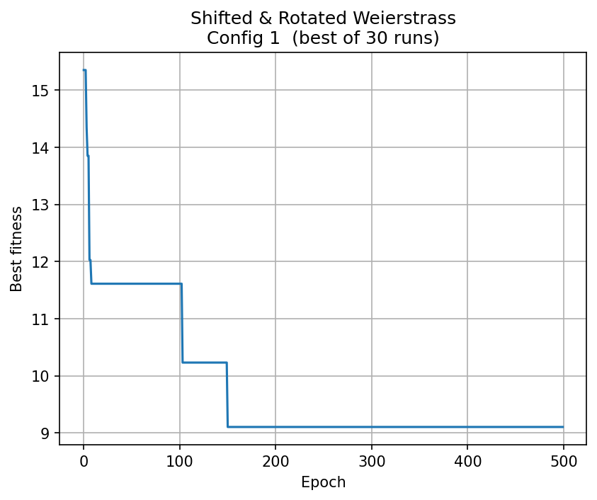
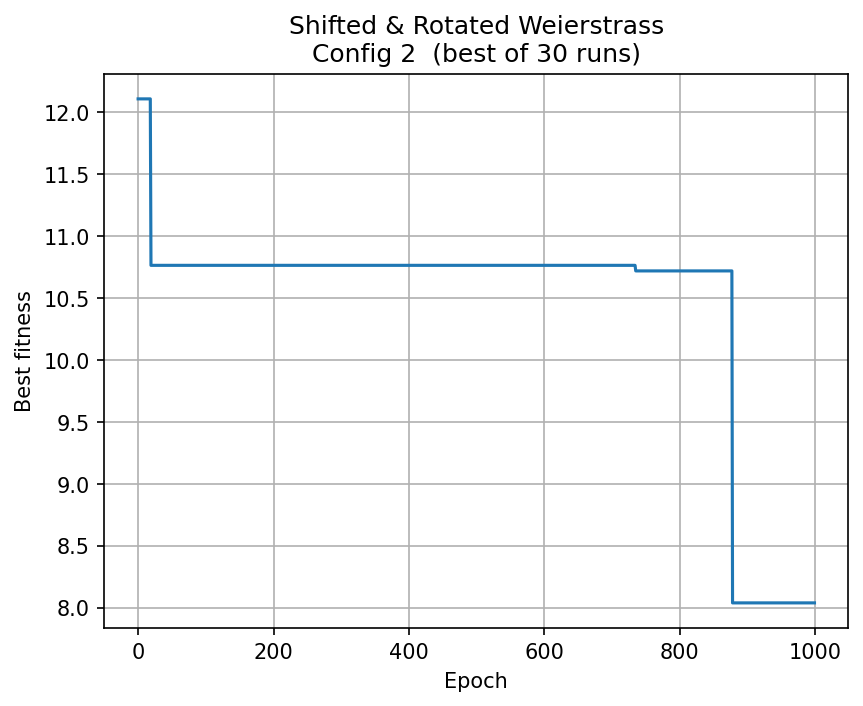
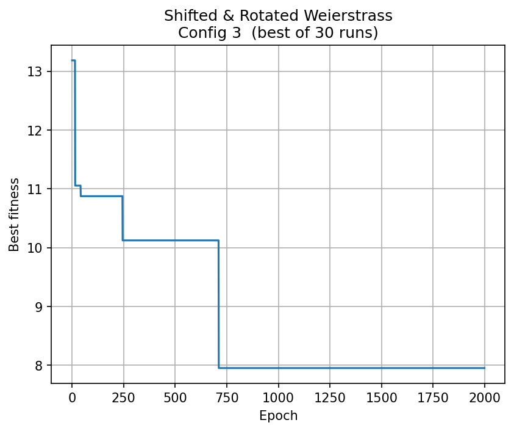

# Comparativo entre os Algoritmos PSO e ACO

## Função 1: Rotated High Conditioned Elliptic Function
### PSO

O PSO apresentou uma tendência de convergência acelerada à medida que a população e o número de iterações aumentaram. Os melhores resultados foram obtidos utilizando um enxame maior (100 partículas) e 2000 iterações, evidenciando uma redução contínua e estável dos valores. As curvas de desempenho sugerem que o PSO conseguiu explorar de forma eficiente o espaço de busca da função, mesmo diante do desafio imposto pelas diferentes escalas das variáveis.

### ACO

O ACO exibiu uma tendência de convergência, com a média dos resultados apresentando melhora progressiva ao longo das iterações. Contudo, o desempenho foi mais instável em comparação ao PSO, principalmente nas configurações com maior número de formigas. Observou-se indícios de estagnação precoce nas configurações menores, e mesmo com o aumento das iterações, a evolução do fitness permaneceu restrita.

### Análise Comparativa

Uma análise comparativa entre o PSO e o ACO na função Rotated High Conditioned Elliptic evidencia que o PSO foi superior em termos de estabilidade e performance. O PSO apresentou convergência mais rápida, comportamento previsível e suave, especialmente com populações maiores e mais iterações, conseguindo explorar o espaço de busca de forma eficiente mesmo diante das diferentes escalas das variáveis. Por outro lado, o ACO teve dificuldades para escapar de ótimos locais, mesmo com aumento da população e do tempo de execução, o que pode ser atribuído à estabilização do feromônio em soluções subótimas. Além disso, o ACO apresentou oscilações e variações mais intensas entre execuções, mostrando-se mais sensível à configuração dos parâmetros e menos eficaz que o PSO para essa função.

## Função 2: Shifted and Rotated Weierstrass Function

### PSO

Na função Weierstrass, o PSO apresentou desempenho instável. Apesar de configurações com menos partículas terem alcançado bons resultados iniciais, o aumento do tamanho do enxame e do número de iterações não resultou em melhorias significativas. Isso sugere que o PSO teve dificuldade para escapar de mínimos locais, levando à estagnação durante boa parte do processo.

### ACO

Na função Weierstrass, o ACO apresentou desempenho superior ao PSO. Todas as configurações mostraram melhora constante ao longo das iterações, com convergência contínua, especialmente para o enxame menor. Apesar de também enfrentar mínimos locais, o ACO demonstrou maior capacidade de adaptação à função, superando o PSO em robustez e consistência nos resultados.

### Análise Comparativa

Na função Weierstrass, o ACO mostrou-se mais eficaz que o PSO ao lidar com a complexidade da função, embora a diferença de desempenho não tenha sido muito expressiva. O PSO apresentou estagnação e não conseguiu aproveitar o aumento do tamanho do enxame para melhorar os resultados. Já o ACO apresentou ganhos mais consistentes ao longo das iterações, mesmo apresentando maior variância nas execuções com populações maiores.

## Conclusão Geral

- O PSO se destacou na função Elliptic, apresentando convergência eficiente e melhores resultados finais.
- O ACO mostrou vantagem na função Weierstrass, evidenciando maior adaptabilidade em funções multimodais.
- Ambos os algoritmos possuem limitações e pontos fortes, ressaltando a importância de selecionar a heurística conforme as características do problema.
- O aumento do tamanho da população e do número de iterações beneficia ambos os métodos, mas o impacto é mais significativo no PSO, especialmente em funções com menos mínimos locais.